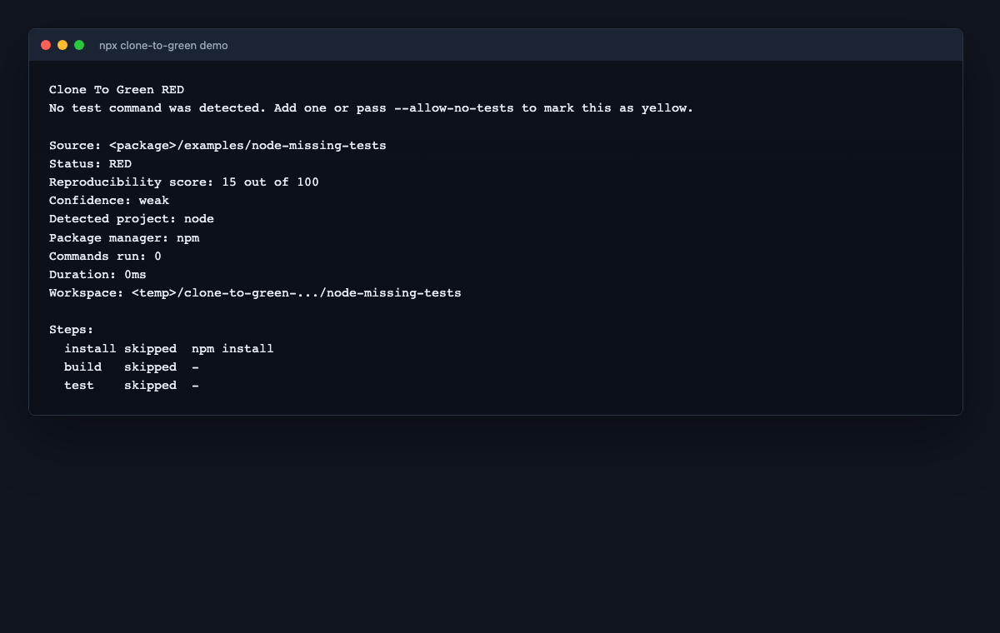

# Clone To Green

**Can a stranger clone your repo and get green?**

Check whether a repo can go from fresh clone to passing tests with no hidden local setup.

Clone To Green creates a clean workspace, detects install and test commands, runs them, and reports whether the repo reached green.
It also explains fragile setup, missing tests, missing lockfiles, env assumptions, and reproducibility risks.



```sh
npx clone-to-green run .
```

```sh
npx clone-to-green demo
```

```text
Clone To Green RED
No test command was detected. Add one or pass --allow-no-tests to mark this as yellow.

Source: <package>/examples/node-missing-tests
Status: RED
Reproducibility score: 15 out of 100
Confidence: weak
Detected project: node
Package manager: npm
Commands run: 0
Duration: 0ms
Workspace: <temp>/clone-to-green-.../node-missing-tests

Steps:
  install skipped  npm install
  build   skipped  -
  test    skipped  -
```

```sh
npx clone-to-green demo --format html --output ctg-demo.html
```

Preview the demo output:

- Terminal output: [docs/assets/demo-output.txt](docs/assets/demo-output.txt)
- Markdown report: [docs/assets/demo-output.md](docs/assets/demo-output.md)
- HTML report: [docs/assets/demo-report.html](docs/assets/demo-report.html)

## What is Clone To Green

Clone To Green is a deterministic reproducibility checker and clean clone smoke test.

It answers one question: can this repository go from a fresh workspace to green without undocumented local setup?

It is not a CI replacement, not a sandbox, and not proof that a project is correct.

## Why this exists

Many repos look healthy until a new contributor, candidate, teammate, or template user tries to clone them.

Clone To Green makes hidden setup visible by running the same basic path a stranger would try: install, build if available, and test.

## Quickstart

```sh
npx clone-to-green run .
```

Common variants:

```sh
npx clone-to-green run . --format markdown --output ctg-report.md
npx clone-to-green run . --allow-no-tests
npx clone-to-green init .
```

## Demo

Run a bundled demo before scanning your own repo:

```sh
npx clone-to-green demo
npx clone-to-green demo --green
npx clone-to-green demo --red
npx clone-to-green demo --format markdown
npx clone-to-green demo --format json
npx clone-to-green demo --format html --output ctg-demo.html
npx clone-to-green demo --badge
```

## Example output

The default demo shows a missing-tests repo so the failure explanation is easy to understand.

```sh
npx clone-to-green demo
```

See [docs/assets/demo-output.txt](docs/assets/demo-output.txt) for screenshot-friendly text output.

## What green means

Green means all required setup commands passed and a real test command ran successfully.

Yellow means setup commands passed, but confidence is partial. For example, optional commands were skipped, no build command was detected, no tests were detected with `--allow-no-tests`, or the reproducibility score is fragile.

Red means the repo failed to reach the required state. No detected tests is red by default.

## Reproducibility score

Every report includes a score from `0` to `100` plus a confidence label:

- `90-100`: strong
- `70-89`: good
- `50-69`: fragile
- `0-49`: weak

The score does not replace green, yellow, or red. It explains fragility.

## Supported projects

Clone To Green uses deterministic file-based detection for:

- Node.js projects with npm, pnpm, yarn, or bun lockfiles
- Python pytest projects
- Go modules
- Rust crates
- Dockerfile-based projects
- Custom projects through `clone-to-green.yml`

## GitHub Actions usage

```yaml
name: Clone To Green

on:
  pull_request:
  push:
    branches: [main]

jobs:
  clone-to-green:
    runs-on: ubuntu-latest
    steps:
      - uses: actions/checkout@v4
      - uses: actions/setup-node@v4
        with:
          node-version: 24.x
      - run: npx clone-to-green run . --ci
```

## Install

```sh
npm install -g clone-to-green
```

Node.js 24 LTS is the supported runtime baseline. Use Node 24 for local development and CI.

## Configuration

Create a starter config:

```sh
npx clone-to-green init .
```

Config files are resolved in this order:

1. `clone-to-green.yml`
2. `clone-to-green.yaml`
3. `.clone-to-green.yml`
4. `.clone-to-green.yaml`

See [docs/configuration.md](docs/configuration.md).

## Report formats

```sh
npx clone-to-green run . --format table
npx clone-to-green run . --format json
npx clone-to-green run . --format markdown --output ctg-report.md
npx clone-to-green run . --format html --output ctg-report.html
```

See [docs/report-schema.md](docs/report-schema.md).

## Security model

Clone To Green creates a clean workspace. It does not create a security sandbox.

Clone To Green runs install, build, and test commands from the target repository. That means arbitrary code execution. Only run it on code you trust, or run it inside your own isolated environment.

The environment allowlist reduces accidental secret leakage, but it does not make untrusted code safe.

See [docs/security-model.md](docs/security-model.md).

## Limitations

- It does not isolate untrusted code.
- It does not replace CI.
- It does not prove project correctness.
- It cannot infer every monorepo package boundary.
- It cannot know every hidden external service dependency.

## Roadmap

- JUnit XML output for CI test views
- PR comment mode
- Docker or container isolation
- Monorepo package matrix
- `ctg explain` command

## Contributing

Good first contributions:

- Add detector for another package manager.
- Improve Python project detection.
- Improve monorepo detection.
- Add a new failure analysis pattern.
- Improve HTML report formatting.
- Add examples from real repos.

See [CONTRIBUTING.md](CONTRIBUTING.md) and [docs/good-first-issues.md](docs/good-first-issues.md).

## License

MIT
